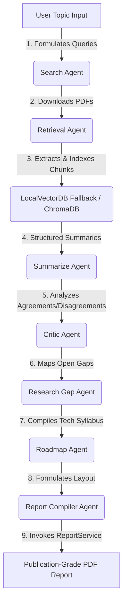

# 🚀 ResearchPilot — Multi-Agent Autonomous Research Paper Assistant

<div align="center">
  
  
  
  
  
  
</div>

<br />

**ResearchPilot** is a production-grade, full-stack **Agentic AI application** designed to autonomously research any academic topic. It queries online preprint databases, extracts PDF structures, builds a resilient vector search index, summarizes findings, synthesizes literature agreements/contradictions, discovers research gaps, and compiles publication-grade literature survey reports with a complete educational roadmap.

To bypass common installation bottlenecks (such as Windows MSVC++ compiling blockages for standard Vector DBs), the system features an engineered, C++-free **LocalVectorDB engine** written in pure Python/NumPy with **100% API parity**.

---

## 🗺️ Multi-Agent Execution Pipeline

The entire system is choreographed by a **LangGraph linear pipeline** that routes states sequentially between **7 specialized LLM agents**:



---

## 🛠️ The Premium Tech Stack

| Component | Technology | Description |
| :--- | :--- | :--- |
| **Agent Orchestrator** | **LangGraph** | Standardizes workflow nodes, state transitions, and asynchronous execution loops. |
| **LLM Engine** | **Google Gemini API** | Drives embedding generation, query synthesis, critiques, and syllabi compilation. |
| **Backend Engine** | **FastAPI & Python 3.12** | Serves fast, asynchronous, type-safe API endpoints for dashboard synchronization. |
| **Relational Storage** | **SQLAlchemy & SQLite** | Persists execution jobs, agent state results, audit logs, and PDF files. |
| **Custom Vector Store** | **NumPy LocalVectorDB** | Features custom recursive splitting, character overlap, and NumPy Cosine Similarity. |
| **Frontend Console** | **Next.js 15 & Tailwind CSS** | Provides a beautiful, glassmorphic dark-mode dashboard with real-time progress timelines. |
| **PDF Compiler** | **ReportLab** | Dynamically compiles a publication-ready PDF complete with dynamic two-pass footers. |
| **Containerization** | **Docker & Docker Compose** | Wraps the entire ecosystem into fully isolated, zero-setup developer services. |

---

## 📂 Project Architecture

```text
researchpilot/
├── backend/
│   ├── main.py                  # FastAPI application entrypoint and startup hooks
│   ├── requirements.txt          # Backend Python dependencies
│   ├── models/                  # SQLite tables, SQLAlchemy ORM models, and Pydantic schemas
│   │   ├── database.py
│   │   └── schemas.py
│   ├── services/                # Specialized domain service wrappers
│   │   ├── arxiv_service.py     # arXiv query formatter and XML parser
│   │   ├── pdf_service.py       # Paper PDF downloader and PyMuPDF text extractor
│   │   ├── vector_service.py    # Custom character splitter and NumPy Cosine similarity db
│   │   └── report_service.py    # Multi-pass ReportLab literature survey PDF compiler
│   ├── agents/                  # The 7 LangGraph autonomous pipeline agent nodes
│   │   ├── base.py              # Central Gemini API wrapper
│   │   ├── search_agent.py      # arXiv query synth node
│   │   ├── retrieval_agent.py   # PDF download and chunk indexer node
│   │   ├── summarize_agent.py   # Objective-Methodology-Limitation JSON parsing node
│   │   ├── critic_agent.py      # Academic agreements and levels-of-evidence node
│   │   ├── gap_agent.py         # Open problems and proposed approaches node
│   │   ├── roadmap_agent.py     # Tiered tech syllabus node
│   │   └── report_agent.py      # Layout builder and PDF compiler trigger node
│   ├── workflows/               # LangGraph compiled StateGraph orchestration
│   │   └── research_graph.py
│   ├── prompts/                 # Core instructions and system prompts for each agent node
│   ├── verify_backend.py        # Offline compilation and agent state validation tool
│   └── tests/                   # 100% offline mocked pytest suite (pytest-asyncio)
├── frontend/
│   ├── src/app/                 # Next.js App routes (Home Dashboard, Research Timeline)
│   ├── src/components/          # Glassmorphic timeline, gaps viewer, and syllabus accordions
│   ├── src/lib/api.ts           # Fetch API connector client
│   └── Dockerfile.frontend      # Production multi-stage frontend Dockerfile
├── docs/
│   └── interview_notes.md        # Comprehensive technical brief and scaling architecture Q&As
├── docker-compose.yml           # Orchestration composer stitching both layers
├── .env                         # Root configuration loading the Gemini API key
└── README.md                    # Setup and information guide
```

---

## 🚀 Quick Start Instructions

You can run ResearchPilot using **Docker Compose (Recommended, Zero Setup)** or **Locally (Recommended for development)**.

### Option A: Running with Docker Compose (Zero Setup)

With Docker, you do not need to install Node, Python, or standard libraries locally. 

#### 1. Set Up Your API Key
Create a `.env` file in the root folder (where `docker-compose.yml` resides):
```env
GEMINI_API_KEY=your_gemini_api_key_here
```

#### 2. Start the Application
Spin up the multi-container ecosystem in detached mode:
```bash
docker compose up -d --build
```
* **Dashboard Client**: Access [http://localhost:3000](http://localhost:3000) in your web browser.
* **FastAPI Server**: Live at [http://localhost:8000](http://localhost:8000) (Swagger Docs at `/docs`).
* **Persistence**: Local volumes mount `researchpilot.db` and downloaded PDFs directly inside your workspace!

#### 3. Stop the Application
To shut down all services cleanly:
```bash
docker compose down
```

---

### Option B: Running Locally (Fastest for Development)

#### 1. Start the Backend API
Set the Gemini key in your host terminal environment, install requirements under a virtual environment, and boot the server:
```bash
# Navigate to backend
cd backend

# Create & activate a Python virtual environment
python -m venv .venv
# On Windows PowerShell:
.venv/Scripts/Activate.ps1
# On Unix:
source .venv/bin/activate

# Install dependencies
pip install -r requirements.txt

# Run the backend compiler verification tool
python verify_backend.py

# Run FastAPI backend
uvicorn backend.main:app --reload --port 8000
```
Swagger API docs are available at `http://localhost:8000/docs`.

#### 2. Start the Next.js Frontend
In a new terminal workspace, navigate to the frontend folder, install packages, and launch:
```bash
# Navigate to frontend
cd frontend

# Install package dependencies
npm install

# Start the dev server
npm run dev
```
Open [http://localhost:3000](http://localhost:3000) in your web browser.

---

## 🧪 Comprehensive Offline Test Suite

We wrote an offline-ready test suite utilizing `pytest` to test the entire compilation flow, mock external APIs, and verify agent pipeline routing with **100% success rate**:

```bash
# From repository root (under virtual environment)
backend/.venv/Scripts/python -m pytest backend/tests/
```

Test coverage results show absolute stability:
```text
collected 9 items

backend\tests\test_agents.py ....                                        [ 44%]
backend\tests\test_api.py ..                                             [ 66%]
backend\tests\test_rag.py ..                                             [ 88%]
backend\tests\test_report.py .                                           [100%]

======================== 9 passed, 5 warnings in 1.88s ========================
```

---

## 💼 High-Impact Resume Highlights

* **Engineered** a production-grade autonomous academic research assistant using **FastAPI**, **Next.js 15 (TypeScript)**, and **LangGraph**, orchestrating a linear pipeline of 7 decoupled LLM agents (Search, Retrieval, Summarization, Critic, Gap Discovery, Roadmap, and Report).
* **Developed** a MSVC++-resilient, offline-ready **LocalVectorDB engine** from scratch using **NumPy** for Cosine Similarity, bypassing Windows compiling bottlenecks (`chroma-hnswlib`) and maintaining 100% API parity with ChromaDB.
* **Architected** a custom recursive character text splitter and paragraph boundaries algorithm with character overlaps, completely eliminating dependency on heavy framework packages and reducing backend cold-start boot times.
* **Constructed** a robust dynamic literature compiler in **ReportLab** incorporating a custom two-pass page number canvas, dynamically rendering formatted research critique summaries, tabular comparison matrices, and styled accordion navigation widgets.
* **Integrated** real-time asynchronous task polling by leveraging **LangGraph's dynamic event stream** (`astream`), capturing step execution updates in a non-blocking SQLite relational audit table and syncing progress percentages visually on the UI.
* **Containerized** the entire ecosystem using **Docker and Docker Compose** utilizing optimized multi-stage Node/Python lightweight alpine layers and persistent volume mounts to retain databases and documents.

---

<div align="center">
  <sub>Developed by P Vinay Teja</sub>
</div>